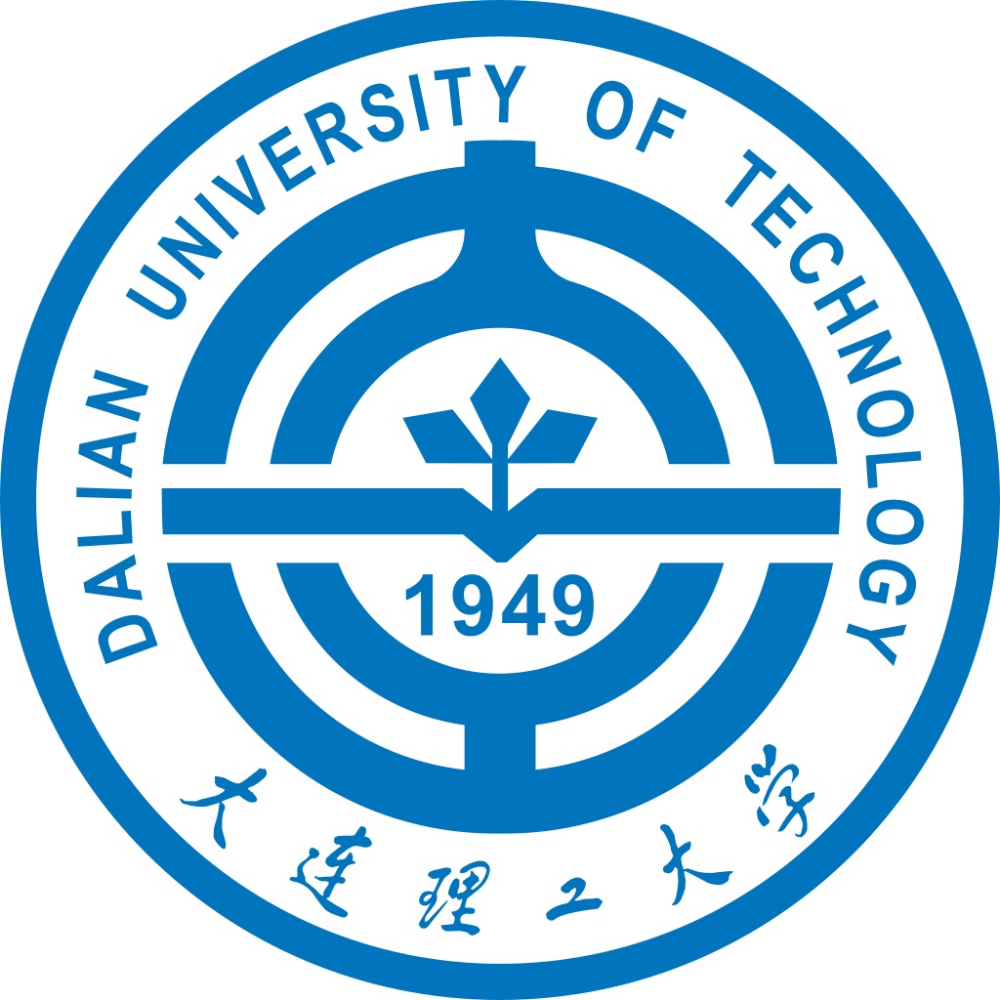








  <h2>Hi, I am yuke :)</h2>

I am currently pursuing my master's degree at [Fudan University](https://www.fudan.edu.cn/en/) under the supervision of Professor [Yang Chen](https://chenyang03.wordpress.com/). Prior to this, I earned my Bachelor's degree from the School of Computer Science and Technology at [Dalian University of Technology](https://www.dlut.edu.cn/) in 2020.

# 📄 Publications

***Sensys 2024 - ACM Conference on Embedded Networked Sensor Systems, Hangzhou, China, 2024***

Demo: CTSim: A Scalable and Flexible Cybertwin Network
Simulator for Internet of Things Scenarios.

**Yuke Ma**, Shihan Lin, Yang Chen*, Jun Wu

---

***ICC 2023 - IEEE International Conference on Communications, Rome, Italy, 2023***

[SocialCache: A Pervasive Social-Aware Caching Strategy for Self-Operated Content Delivery Networks of Online Social Networks.](https://doi.org/10.1109/ICC45041.2023.10279588)

Tiancheng Guo, **Yuke Ma**, Mengying Zhou, Xin Wang, Jun Wu, Yang Chen.

---

# 🎓 Research Intern

- **Research Intern (June.2024 - Aug. 2024)**

    
    

        <blockquote>
             Max Planck Institute for Informatics 
             Network and Cloud Systems
        </blockquote>
    

# 🎓 Education

- **Graduate Student of Computer Science (Sep.2022 - now)**

    
    

        <blockquote>
             Fudan University 
             School of Computer Science Fudan University
        </blockquote>
    

- **Undergraduate Student of Computer Science and Technology (Japanese Intensive) (Sep. 2015 - Jun. 2020)**

    
    

        <blockquote>
            Dalian University of Technology 
            School of Computer Science and technology
        </blockquote>
    

# 💼 Employment

- **Embedded Software Engineer, TP-Link Technologies Co., Ltd. (Jul.2020 - Jun. 2022)** 

    
        <blockquote>
            Consumer Electronics R&D Department 
        </blockquote>

# 🏆 Honors and Awards

<ul>
  <li>Fudan University Academic Excellence Scholarship, First Class, 2023</li>
  <li>Fudan University Graduate Freshman Scholarship, 2022</li>
  <li>National Inspirational Scholarship, 2019</li>
  <li>Dalian University of Technology Excellent Scholarship, 2018</li>
</ul>

- **Languages**: English (Fluent), Japanese (Intermediate)

I speak English (CET-6 score of 555) and Japanese (JLPT N2 level).

