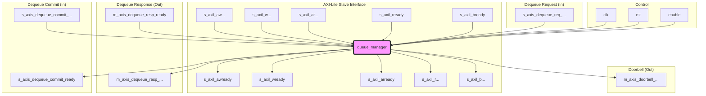

# Queue Manager (`queue_manager.v`) Documentation

## 1. Overview




The `queue_manager` is a high-performance hardware block responsible for managing the state of multiple (up to 256) descriptor queues. It serves as the central coordination point between the host system (CPU) and the FPGA's internal logic (e.g., DMA engines, schedulers).

Its primary functions are:
1.  **Host-to-FPGA Communication**: Allowing the host to configure queues and "ring the doorbell" by updating a queue's **Producer Pointer**.
2.  **FPGA-to-Host Communication**: Allowing FPGA logic to request descriptors ("dequeue"), receive the physical memory address of that descriptor, and later "commit" the operation once it's complete.

It is designed around a pipelined architecture (`PIPELINE = 2`) to hide BRAM read latency and an "operation table" to manage a large number of in-flight, out-of-order dequeue operations.

## 2. Core Components

The module's logic is built on three key internal structures:

* **`queue_ram` (BRAM)**:
    * A 128-bit wide Block RAM that stores the complete state for all 256 queues.
    * Each 128-bit entry (one per queue) stores:
        * `base_addr` (64 bits): The 64-bit physical base address of the descriptor ring in host memory.
        * `prod_ptr` (16 bits): The **Producer Pointer**, written by the host.
        * `cons_ptr` (16 bits): The **Consumer Pointer**, written by this module upon a *commit*.
        * `enable` (1 bit): Whether the queue is active.
        * `log_queue_size` (4 bits): The size of the queue as a power of 2.
        * `cpl_queue` (8 bits): The completion queue index associated with this queue.
        * `op_index` (8 bits): A tag that "locks" the queue, pointing to an entry in the `op_table` if an operation is in-flight.

* **`op_table` (Distributed RAM)**:
    * This is the key to the module's high-performance, asynchronous design. It's a small, fast table (e.g., 16 entries) that tracks all *in-flight* dequeue operations.
    * When the FPGA requests a descriptor, it is instantly given an `op_tag` (the index into this table). The `queue_manager` records the operation details here and moves on.
    * Each entry stores:
        * `active` (1 bit): `1` if this `op_tag` is in use.
        * `commit` (1 bit): `1` if the downstream module (e.g., DMA) has signaled it's finished with this operation.
        * `queue` (8 bits): The queue index for this operation.
        * `queue_ptr` (16 bits): The **new** consumer pointer value (`cons_ptr + 1`) that *will be* written to `queue_ram` once this operation is finalized.

* **Pipelined Datapath (`PIPELINE = 2`)**:
    * All operations that access the `queue_ram` pass through a 2-stage pipeline.
    * This design perfectly **hides the 1-cycle read latency of the BRAM**. An operation is accepted in Stage 0 (T0), the BRAM read begins, and by the time the operation reaches the Execute stage (Stage 1, T2), the corresponding data from the BRAM has also arrived and is ready for use.

* **Arbitration Logic**:
    * A 4-input priority-encoded arbiter at the entrance of the pipeline (Stage 0). It decides which operation gets to use the pipeline in any given cycle.

## 3. Interfaces

The module exposes five primary AXI-Stream and AXI-Lite interfaces.

| Interface | Type | Direction | Description |
| :--- | :--- | :--- | :--- |
| `s_axil_...` | AXI4-Lite | Slave | **Control/Status Port**: Used by the Host (CPU) to configure queues (set base address, size) and write the producer pointer (doorbell). |
| `s_axis_dequeue_req_...`| AXI-Stream | Slave | **Dequeue Request**: Used by internal FPGA logic (e.g., a scheduler) to request a new descriptor from a specific queue. |
| `m_axis_dequeue_resp_...`| AXI-Stream | Master | **Dequeue Response**: The reply to a `dequeue_req`. It provides the `op_tag` and the calculated 64-bit physical memory address of the descriptor. |
| `s_axis_dequeue_commit_...`| AXI-Stream | Slave | **Dequeue Commit**: Used by the downstream module (e.g., DMA engine) *after* it has finished processing the descriptor. It sends back the `op_tag` to signal completion. |
| `m_axis_doorbell_...` | AXI-Stream | Master | **Doorbell Event**: A single-cycle pulse sent to internal FPGA logic (e.g., a scheduler) to notify it that a *new* descriptor has been made available by the host. |

## 4. Core Operational Flows

The module has two primary operational flows that run in parallel.

### Flow B: Host-to-FPGA (AXI-Lite Write "Doorbell")

This flow occurs when the host writes new descriptors to memory and wants to notify the FPGA.

**Goal:** Update a queue's `prod_ptr` and alert the FPGA scheduler.

```mermaid
sequenceDiagram
    participant Host as Host (CPU)
    participant QM as Queue Manager
    participant RAM as queue_ram
    participant Logic as FPGA Scheduler

    Host->>+QM: T0: AXI Write Req (Queue Q, Reg=4, Ptr=N)
    Note over QM: T0: Stage 0: Accept Req.<br/>Initiate RAM Read for Q's 'enable' bit.
    QM->>RAM: T0: Read Addr = Q
    
    QM-->>-Host: T1: AXI Write Ready
    Note over QM: T1: Stage 0 -> 1: Req(Q, N) shifts to pipeline stage 1.
    RAM-->>QM: T1: BRAM Data[Q] available (has 'enable' bit).

    Note over QM: T2: Stage 1: Execute.<br/>Req(Q, N) and Data[Q] are aligned.
    Note over QM: T2: Logic checks 'enable' bit from Data[Q].
    QM->>RAM: T2: Prepare Write: Addr=Q, Data=N, BE=prod_ptr
    QM->>+Host: T2: AXI Response (BVALID)

    Host-->>-QM: T3: AXI Response Ready (BREADY)
    Note over RAM: T3 (posedge clk): Physical Write of Ptr=N into RAM[Q].
    alt if (Data[Q].enable == 1)
        QM->>+Logic: T3 (posedge clk): Fire Doorbell pulse for Queue Q.
        Logic-->>-QM: T4: (Doorbell pulse ends).
    end