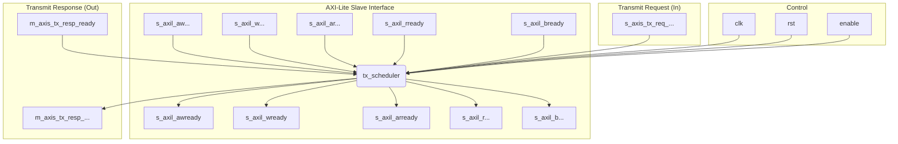

# TX Scheduler (`tx_scheduler.v`) Documentation

## 1. Overview




## 2. Interface Signals

### AXI-Lite Slave Interface
- `s_axil_awaddr` (input): AXI-Lite write address.
- `s_axil_awprot` (input): AXI-Lite write protection type.
- `s_axil_awvalid` (input): AXI-Lite write address valid.
- `s_axil_awready` (output): AXI-Lite write address ready.
- `s_axil_wdata` (input): AXI-Lite write data.
- `s_axil_wstrb` (input): AXI-Lite write strobes
- `s_axil_wvalid` (input): AXI-Lite write valid.
- `s_axil_wready` (output): AXI-Lite write ready.
- `s_axil_bresp` (output): AXI-Lite write response.
- `s_axil_bvalid` (output): AXI-Lite write response valid.
- `s_axil_bready` (input): AXI-Lite write response ready.
- `s_axil_araddr` (input): AXI-Lite read address.
- `s_axil_arprot` (input): AXI-Lite read protection type.
- `s_axil_arvalid` (input): AXI-Lite read address valid.
- `s_axil_arready` (output): AXI-Lite read address ready.
- `s_axil_rdata` (output): AXI-Lite read data.
- `s_axil_rresp` (output): AXI-Lite read response.
- `s_axil_rvalid` (output): AXI-Lite read valid.
- `s_axil_rready` (input): AXI-Lite read ready.

### Transmit Request Interface
- `s_axis_tx_req_tdata` (input): Transmit request data.
- `s_axis_tx_req_tkeep` (input): Transmit request byte enable.
- `s_axis_tx_req_tvalid` (input): Transmit request valid.
- `s_axis_tx_req_tready` (output): Transmit request ready.
- `s_axis_tx_req_tlast` (input): Transmit request last signal.

### Transmit Response Interface
- `m_axis_tx_resp_tdata` (output): Transmit response data.
- `m_axis_tx_resp_tkeep` (output): Transmit response byte enable.
- `m_axis_tx_resp_tvalid` (output): Transmit response valid.
- `m_axis_tx_resp_tready` (input): Transmit response ready. 
- `m_axis_tx_resp_tlast` (output): Transmit response last signal.

### Control Signals
- `clk` (input): System clock.
- `rst` (input): System reset, active high.
- `enable` (input): Module enable signal.


## 3. Functional Description
The TX Scheduler module is responsible for managing the transmission of packets from the FPGA NIC to the host system. It interfaces with the AXI-Lite bus for configuration and control, and it handles transmit requests and responses through dedicated streaming interfaces. It ensures that packets are transmitted in an orderly fashion, adhering to any scheduling policies defined by the system.

## 4. Configuration Registers
The TX Scheduler exposes several configuration registers via the AXI-Lite interface. These registers allow the host to configure scheduling parameters, monitor status, and control the operation of the TX Scheduler. Specific register addresses and their functions can be found in the Corundum documentation. 

## 5. Timing and Performance
The TX Scheduler is designed to operate at high speeds, supporting line-rate transmission for various Ethernet standards. It employs pipelining and buffering techniques to ensure minimal latency and high throughput, making it suitable for demanding networking applications.

```python3

import logging
logging.basicConfig(level=logging.INFO)
logger = logging.getLogger(__name__)

def tx_scheduler_info():
    logger.info("TX Scheduler module initialized.")
    # Additional initialization code can go here
    return

```


The `tx_scheduler` module is a critical component of the Corundum FPGA NIC architecture, responsible for managing the transmission of packets from the FPGA to the host system. It interfaces with the AXI-Lite bus for configuration and control, and it handles transmit requests and responses through dedicated streaming interfaces. Its primary functions include:
- Receiving transmit requests from the FPGA logic.
- Scheduling and prioritizing packet transmissions based on defined policies.
- Sending transmit responses back to the FPGA logic.        
- Providing status and control via the AXI-Lite interface.
